# GoCareers Project Architecture Guide

This guide explains how the consulting platform works for employees, consultants, admins, and operations teams.

The diagrams are **Mermaid diagrams**, so they render as vector diagrams in GitHub, many Markdown viewers, and internal documentation tools.

---

## 1. Big Picture

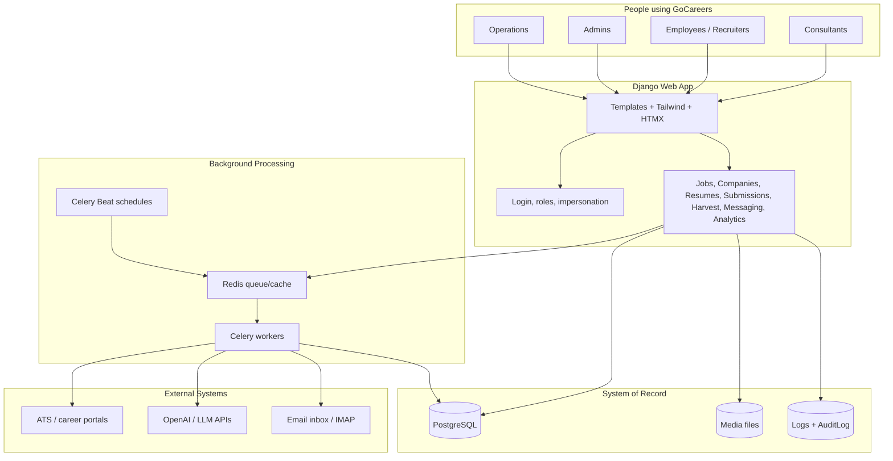

- **Django** is the main application.
- **PostgreSQL** stores users, jobs, raw harvested jobs, resumes, applications, settings, and audit logs.
- **Celery + Redis** run slow/background work: harvesting, enrichment, sync, resume generation, email polling, notifications.
- **ATS platforms** provide job data through APIs, HTML pages, or Jarvis URL ingestion.
- **OpenAI/LLM** is used for resume generation, enrichment, classification, and review assistance.

---

## 2. Who Uses What

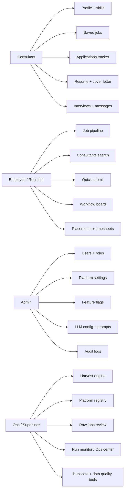

- **Consultants** mainly use self-service profile, resume, applications, saved jobs, interviews, and messages.
- **Employees/recruiters** manage jobs, consultants, submissions, workflow, and placements.
- **Admins** manage platform behavior, feature flags, LLM settings, broadcasts, and audit logs.
- **Ops/superusers** run and monitor the harvest engine and data-quality pipeline.

---

## 3. Main Product Modules

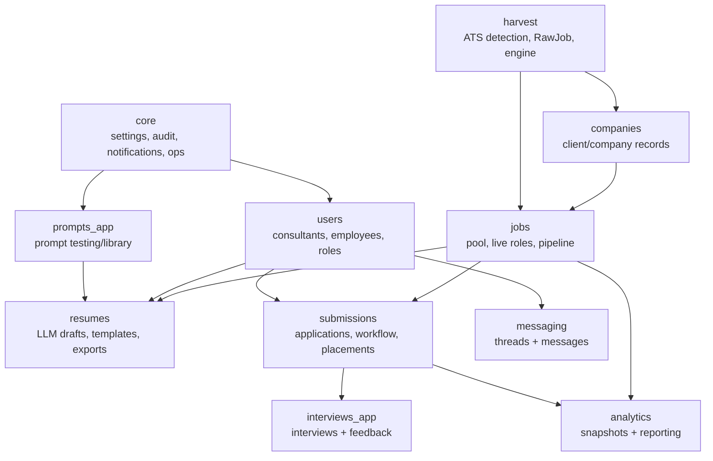

- **core** controls platform-wide behavior: settings, audit, feature flags, LLM config, notifications, broadcasts, ops center.
- **users** holds custom users, consultant profiles, employee profiles, marketing roles, saved jobs, and profile history.
- **companies** stores company/client organization data used by jobs and harvest.
- **jobs** owns the canonical `Job` pool/live pipeline.
- **harvest** owns external platform detection, raw job storage, source payload snapshots, batches, Jarvis, duplicates, and engine config.
- **resumes** generates and edits resume drafts, cover letters, interview prep, and document exports.
- **submissions** tracks applications, workflow, placements, timesheets, commissions, email events, and follow-ups.
- **analytics** stores reporting snapshots and funnel/revenue events.

---

## 4. User Journey Diagram

```mermaid
flowchart TB
  subgraph ConsultantFlow["Consultant Journey"]
    CProfile["Create/update profile"]
    CSearch["Browse jobs"]
    CSave["Save job"]
    CApply["Self-apply / track application"]
    CResume["Generate resume / cover letter"]
    CInterview["Interview prep + feedback"]
  end

  subgraph EmployeeFlow["Employee / Recruiter Journey"]
    ESearch["Search consultants"]
    EJob["Create or approve job"]
    EMatch["Review matches"]
    ESubmit["Submit consultant"]
    EWorkflow["Move workflow status"]
    EPlacement["Create placement"]
  end

  subgraph AdminFlow["Admin Journey"]
    ASettings["Configure platform"]
    ARoles["Manage users + roles"]
    AFlags["Feature controls"]
    ALLM["LLM + prompt settings"]
    AAudit["Audit logs"]
  end

  CProfile --> CSearch --> CSave --> CApply --> CResume --> CInterview
  ESearch --> EJob --> EMatch --> ESubmit --> EWorkflow --> EPlacement
  ASettings --> ARoles --> AFlags --> ALLM --> AAudit
```

- Consultants focus on profile quality, job discovery, resume output, and application tracking.
- Employees focus on finding the right consultant, submitting them, and managing the workflow.
- Admins focus on configuration, access, safety, and observability.

---

## 5. Harvest Engine Overview

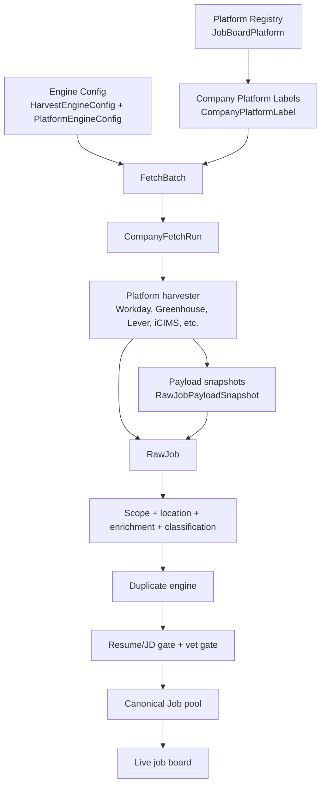

- **Platform Registry** defines supported ATS/job board platforms, URL patterns, support tier, and rate limits.
- **Company Platform Labels** connect each company to an ATS platform and tenant.
- **FetchBatch** groups a bulk run; **CompanyFetchRun** tracks one company inside that batch.
- **Harvesters** fetch jobs from ATS platforms.
- **RawJobPayloadSnapshot** stores source evidence for future debugging and reclassification.
- **RawJob** stores normalized operational job data.
- Jobs only move forward when they pass scope, location, JD, classification, duplicate, and vet checks.

---

## 6. Raw Job Lifecycle

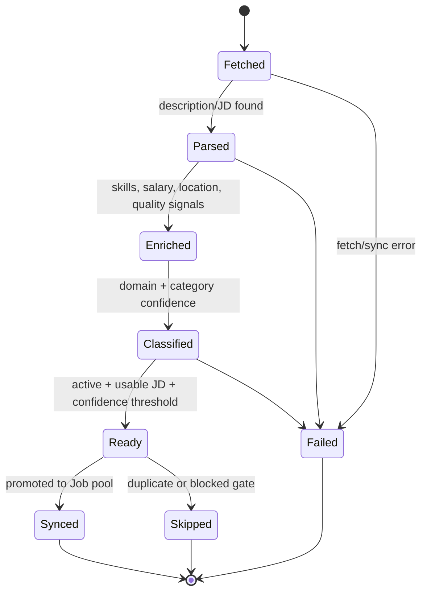

- **Fetched** means the job exists in raw storage.
- **Parsed** means a usable description or JD was captured.
- **Enriched** means fields like skills, work mode, salary, seniority, and quality signals were extracted.
- **Classified** means domain/category routing has enough signal.
- **Ready** means it can be reviewed or synced.
- **Synced** means it became a canonical `Job`.
- **Skipped** means the engine found a reason not to promote it.

---

## 7. Data Model Map

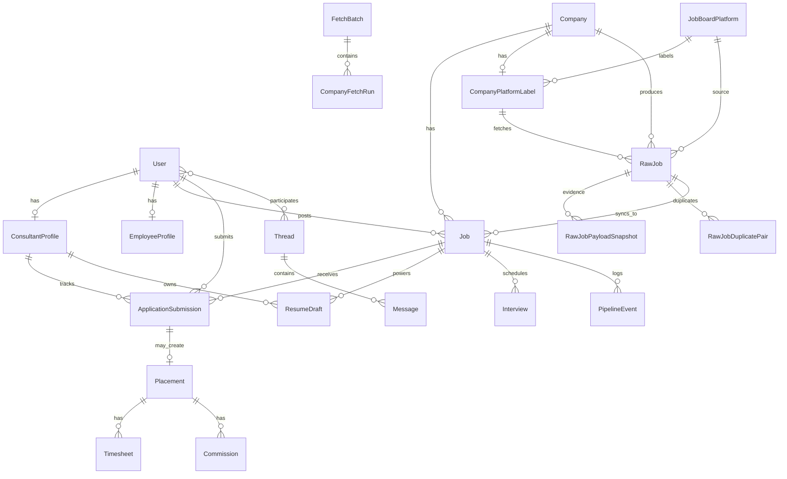

- `RawJob` is the harvested source job.
- `Job` is the trusted internal job used by employees and consultants.
- `ApplicationSubmission` connects consultants to jobs.
- `ResumeDraft` connects a consultant and a job through LLM-generated resume output.
- `AuditLog`, `PipelineEvent`, `FetchBatch`, and `CompanyFetchRun` help explain what happened.

---

## 8. Jobs Pipeline

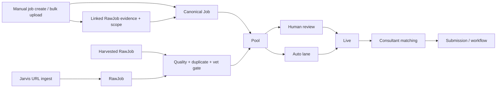

- Jobs can come from employees, bulk upload, harvest, or Jarvis.
- Manual and bulk-created jobs are still canonical `Job` records, but the system also creates/links a `RawJob` evidence row so country scope, payload snapshots, enrichment, lineage, and analytics stay consistent.
- Harvest and Jarvis jobs start as `RawJob` records, then pass quality, duplicate, and vet gates before becoming usable jobs.
- Employees/admins can approve, reject, revalidate, archive, or restore jobs.
- Live jobs become available to consultants and workflow users.

---

## 9. Resume And LLM Flow

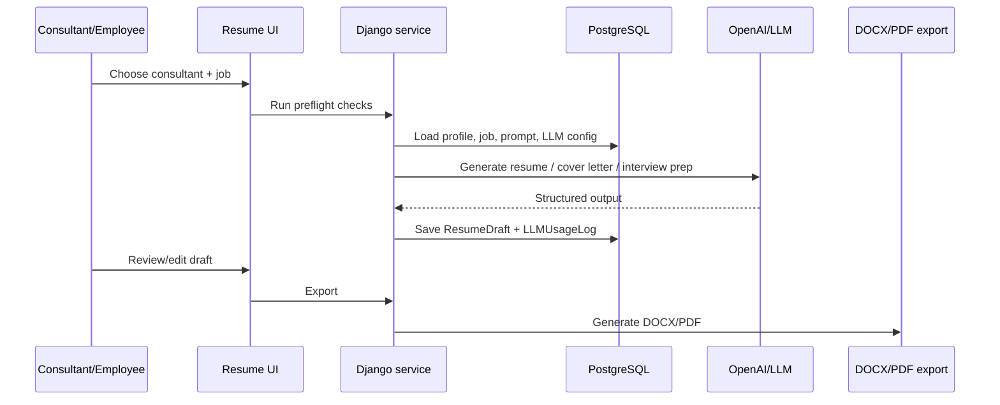

- Resume generation uses consultant profile data, job data, prompt configuration, and LLM settings.
- Drafts are saved, reviewed, regenerated, promoted, and exported.
- LLM usage is logged for audit and cost tracking.
- Admins can tune prompts and LLM config without changing the main workflow.

---

## 10. Submission And Placement Flow

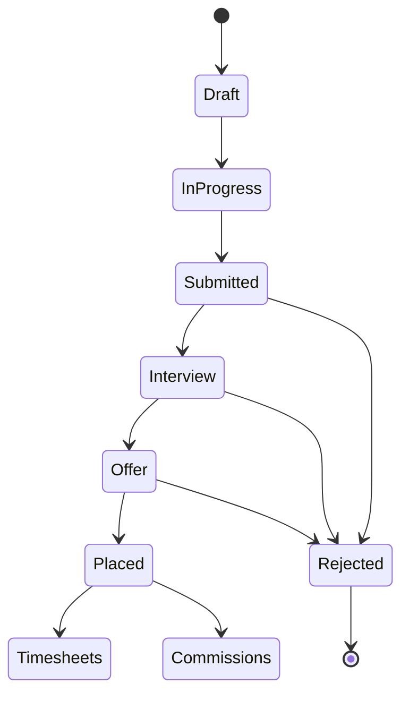

- Submissions track where each consultant stands for a job.
- Workflow tools support claiming, locking, starring, external application marking, and status updates.
- Placements create downstream timesheet and commission records.
- Email events and reminders help keep stale applications visible.

---

## 11. Admin And Ops Control Plane

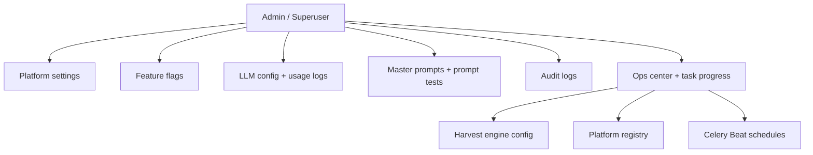

- **Platform settings** control branding, theme, nav, maintenance mode, and system behavior.
- **Feature flags** control who can access what.
- **LLM config** stores provider/model/key settings and usage logs.
- **Audit logs** record important mutations and security-sensitive activity.
- **Ops center** tracks tasks, schedules, and long-running work.
- **Harvest engine config** controls countries, geocoding, rate limits, timeouts, and batch behavior.

---

## 12. Platform Registry Working Method

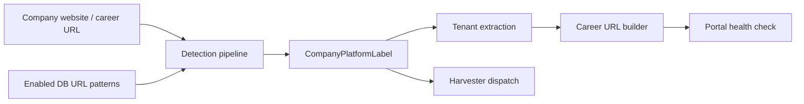

- Detection uses enabled platform registry patterns.
- Tenant extraction turns a job board URL into a reusable platform tenant.
- Health checks prevent hammering dead portals.
- Unsupported/planned platforms should stay disabled until they have verified detection, tenant extraction, and harvester support.
- Missing tenant labels are important because they block automated fetches.

---

## 13. Raw Payload Evidence Layer

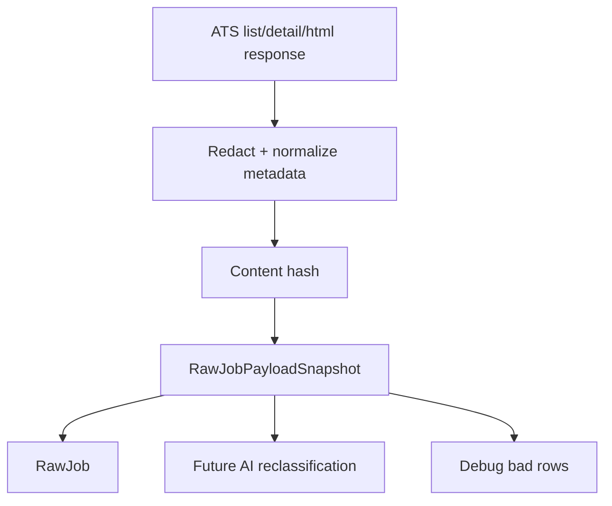

- Source payload snapshots preserve evidence before classification changes the data.
- Hashing prevents repeated identical snapshots.
- Large HTML can be stored compressed.
- Future classifiers can re-read old source evidence without re-fetching the ATS.
- Raw payload access should remain admin/superuser-only.

---

## 14. Security, Audit, And Safety

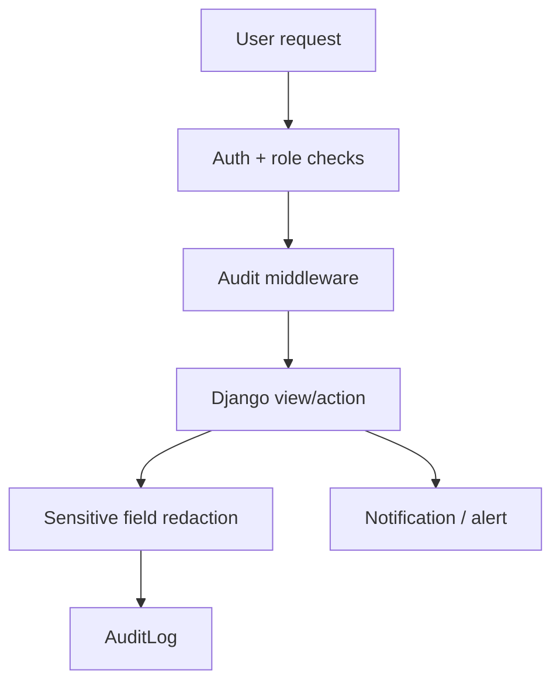

- Role checks separate consultants, employees, admins, and superusers.
- Audit middleware records important POST/change actions.
- Redaction is required for tokens, keys, secrets, signed URLs, and sensitive query data.
- Impersonation should always preserve the real actor.
- Operational actions should be traceable through `AuditLog`, `PipelineEvent`, `FetchBatch`, and `HarvestOpsRun`.

---

## 15. Feature Map By Audience

| Audience | Main Features | What They Should Know |
|---|---|---|
| Consultants | Profile, saved jobs, applications, resumes, cover letters, interviews, messages | Keep profile/skills updated because matching and resume generation depend on it. |
| Employees | Jobs, consultant search, submissions, workflow, placements, timesheets, commissions | Use the pipeline and workflow boards to keep candidate movement visible. |
| Admins | Users, settings, feature flags, LLM config, prompts, audit logs | Configuration changes can affect many users, so use audit logs and test small. |
| Ops | Harvest engine, platform registry, raw jobs, duplicates, schedules, run monitor | Validate platform labels, tenant IDs, country scope, and gate reasons before scaling harvest. |

---

## 16. Operational Checklist

- Before a large harvest:
  - Confirm migrations are applied.
  - Check platform registry enabled/disabled counts.
  - Check missing tenant labels.
  - Run a small fetch sample first.
  - Review RawJob country, location, JD status, domain, and gate reason.

- Before changing platform support:
  - Add/verify URL patterns.
  - Add/verify tenant extraction.
  - Add/verify career URL builder.
  - Confirm harvester coverage.
  - Mark support tier honestly: Healthy, Degraded, Experimental, Unsupported.

- Before changing LLM behavior:
  - Check active model/config.
  - Confirm prompt/version.
  - Run preflight/review on a small sample.
  - Watch LLM usage logs and draft quality.

---

## 17. Simple Explanation For Training

- The system has two job layers:
  - **RawJob**: what we collected from external job portals.
  - **Job**: what we trust enough to show/use internally.

- The harvest engine works like a factory:
  - Detect the company platform.
  - Fetch jobs.
  - Store source evidence.
  - Normalize fields.
  - Enrich and classify.
  - Remove duplicates.
  - Gate bad jobs.
  - Promote good jobs to the pool.

- Consultants use the output:
  - Browse jobs.
  - Track applications.
  - Generate resumes and cover letters.
  - Prepare for interviews.

- Employees use the workflow:
  - Find consultants.
  - Submit candidates.
  - Move applications through status.
  - Create placements and operational records.

- Admins and ops keep the system safe:
  - Configure platforms and LLM.
  - Monitor tasks.
  - Review audit logs.
  - Fix bad data at the source.
