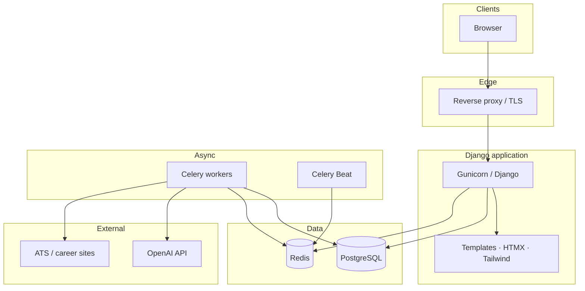
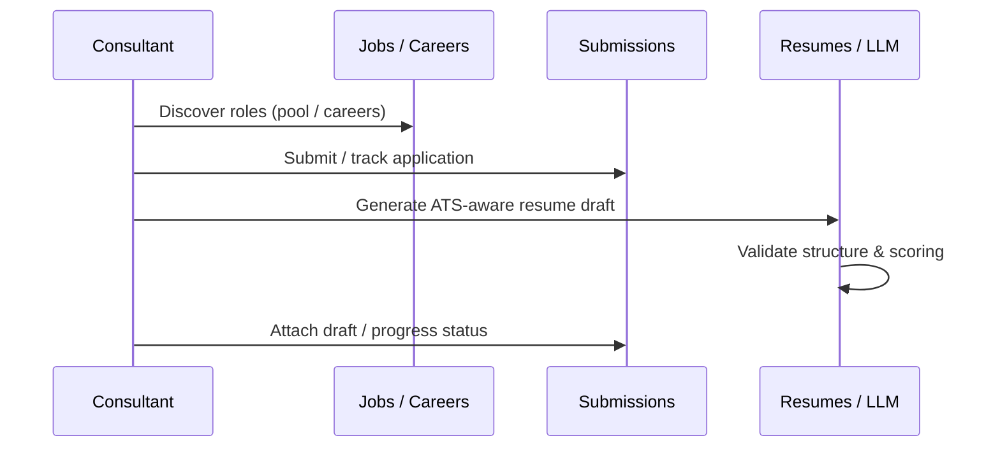
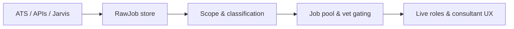

<div align="center">


# GoCareers

### Enterprise-grade consulting & talent operations

**Match consultants to opportunities · Run a real job pipeline · Generate ATS-aware resumes · Harvest and normalize roles at scale**

[](https://www.djangoproject.com/)
[](https://www.python.org/)
[](https://www.postgresql.org/)
[](https://www.docker.com/)
[](https://docs.celeryq.dev/)

[Architecture](#-system-architecture) · [Product flows](#-end-to-end-flows) · [Milestones](#-milestones--capabilities-shipped) · [Run locally](#-getting-started) · [Screenshots](#-screenshot-gallery)

</div>

---

## Table of contents

1. [Overview](#overview)
2. [Who it serves](#who-it-serves)
3. [System architecture](#-system-architecture)
4. [End-to-end flows](#-end-to-end-flows)
5. [Milestones & capabilities shipped](#-milestones--capabilities-shipped)
6. [Repository map](#-repository-map)
7. [Getting started](#-getting-started)
8. [Operations & environments](#-operations--environments)
9. [Observability, audit & compliance](#-observability-audit--compliance)
10. [Screenshot gallery](#-screenshot-gallery)
11. [License](#-license)

---

## Overview

**GoCareers** is a **Django** monolith that powers consultant workforce operations: **public and internal job inventory**, **application workflow**, **AI-assisted resume generation** with structured validation, **messaging and interviews**, and a **large-scale harvest engine** that ingests roles from major ATS platforms into a unified **Raw → Pool → Vetted** pipeline.

The stack is designed for **production deployment on Docker** (Hetzner VPS or equivalent), with **Celery + Redis** for async jobs, **PostgreSQL** as the system of record, and optional **Sentry** for error monitoring.

---

## Who it serves

| Persona | Primary value |
|--------|----------------|
| **Consultants** | Profile, resume tooling, applications, interview loop |
| **Employees / recruiters** | Job pipeline, workflow boards, submissions, placements |
| **Administrators** | Platform config, LLM settings, feature flags, broadcasts, audit trail |
| **Operations** | Harvest batches, scope/domain backfills, link validation, scheduled tasks |

---

## System architecture

High-level component view (renders on GitHub):



**Harvest** tasks fetch and normalize postings; **jobs** owns the canonical `Job` model and gating; **resumes** orchestrates LLM generation and exports; **core** centralizes platform config, LLM config, notifications, and structured **audit logging**.

---

## End-to-end flows

### Consultant: opportunity → application → resume



### Operations: harvest → raw inventory → vet queue



Scheduled and on-demand **management commands** (scope evaluation, domain classification, JD backfill, link validation) keep **standardized fields** (`country_code`, `job_domain`, etc.) aligned so **filters and routing stay trustworthy**. See `CLAUDE.md` and `docs_reference/ai-handoff-current-state.md` for safe ops patterns (`--dry-run`, environments).

---

## Milestones & capabilities shipped

The list below reflects **major themes implemented in this codebase** (not a commercial roadmap checklist).

| Theme | What’s in the product |
|--------|------------------------|
| **Identity & RBAC** | Custom `User` model, admin / employee / consultant surfaces, impersonation hooks |
| **Jobs pipeline** | Internal jobs, public careers, **pipeline UI** (raw / pool / live), **standardized Raw Job filters** (`country_code`, `job_domain` / marketing roles), infinite scroll |
| **Harvest engine** | Multi-platform harvesters (Workday, Greenhouse, Lever, Ashby, SmartRecruiters, etc.), **FetchBatch** company runs, **Job Jarvis** URL ingestion, engine config |
| **Quality & gating** | Raw job gate evaluation, vet lanes, duplicate handling, URL health / link validation |
| **Applications** | Submissions workflow, placements, timesheets, commissions, notifications |
| **AI resumes** | Resume drafts, template/pack concepts, LLM usage logging, encrypted API key storage, prompt / master prompt flows |
| **Comms** | Messaging threads, broadcasts, email-ingest configuration (IMAP) |
| **Interviews** | Interview scheduling app |
| **Companies** | Company records and enrichment-related flows |
| **Analytics** | Reporting app scaffolding |
| **Platform ops** | Ops Center, task scheduler integration, health endpoints, data pipeline dashboard |
| **Governance** | **Structured audit log** (event codes, outcomes, correlation IDs, detail JSON), middleware capture for mutating requests, admin audit UI |

---

## Repository map

```
consulting/
├── apps/
│   ├── analytics/       # Reporting
│   ├── companies/       # Employer / org data
│   ├── core/            # Platform config, LLM, notifications, audit, ops views
│   ├── harvest/         # ATS harvest, RawJob, batches, Jarvis, management commands
│   ├── interviews_app/  # Interview flows
│   ├── jobs/            # Job model, pipeline, public careers, gating, classification
│   ├── messaging/       # Internal messaging
│   ├── prompts_app/     # Prompt library / services
│   ├── resumes/         # Resume generation, ATS validation, exports
│   ├── submissions/     # Applications, workflow, placements
│   └── users/           # Consultants, employees, profiles, RBAC
├── config/              # Settings, URLs, Celery, logging, middleware
├── docs_reference/      # Internal architecture & handoff notes
├── docs/readme-assets/  # README banner + screenshot placeholders
├── templates/           # Django templates (incl. settings, pipeline, harvest)
├── theme/               # Tailwind theme (django-tailwind)
├── docker-compose*.yml  # Local dev, prod, local-harvester (ops CLI)
├── deploy.sh            # Optional push + SSH deploy helper
└── manage.py
```

---

## Getting started

### Prerequisites

- **Python 3.10+**
- **PostgreSQL** (production) or local DB via Docker
- **Redis** (Celery)

### Local install

```bash
git clone https://github.com/gopalakrishnachennu/consulting.git
cd consulting   # or your local folder name (e.g. GoCareers)
python3 -m venv venv
source venv/bin/activate   # Windows: venv\Scripts\activate
pip install -r requirements.txt
cp .env.example .env         # configure DATABASE_URL, SECRET_KEY, OPENAI keys as needed
python manage.py migrate
python manage.py runserver
```

Visit `http://127.0.0.1:8000/`.

### Docker (full stack)

```bash
docker compose up --build
```

Use `docker-compose.prod.yml` on the server with `.env.production`; CI/CD may pull `main` and run **migrations** inside the `web` container (see `.github/workflows/deploy-vps.yml`).

### Optional ML stack

Embedding-heavy paths can use `requirements-ml.txt` where **sentence-transformers** is available; classifiers can fall back to LLM tiers when ML is not installed.

---

## Operations & environments

| Environment | Typical use | Notes |
|-------------|-------------|--------|
| **local-dev** | Developer laptop + local DB | Safe experimentation |
| **local-ops** | Laptop + **prod DB** via `.env.harvester` | **Production writes** — treat like prod |
| **production** | Docker on VPS | Same DB as local-ops if using harvester against prod |

**Rule of thumb:** run broad backfills with **`--dry-run` first**. Details: **`CLAUDE.md`**.

---

## Observability, audit & compliance

- **Application logging:** `config/logging_config.py`
- **Error tracking:** optional **Sentry** (`SENTRY_DSN`)
- **User & admin actions:** **`AuditLog`** with **event codes**, **outcomes**, **correlation IDs**, and **JSON details** (passwords/tokens redacted); **Settings → Audit log** for review and **export JSON** for tickets / AI-assisted triage
- **LLM traceability:** usage logs and request metadata patterns in **core** / **resumes**
- **Pipeline lineage:** `PipelineEvent` and harvest batch / ops audit patterns for job lifecycle

---

## Screenshot gallery

The **vector banner** above (`docs/readme-assets/banner.svg`) renders everywhere without extra setup.

**Add PNG / GIF / WebP** captures under [`docs/readme-assets/`](docs/readme-assets/README.md), then paste markdown here, for example:

```markdown
<p align="center">
  
  <br /><sub>Jobs Command Center — Raw tab, standardized filters</sub>
</p>

<p align="center">
  
  <br /><sub>Short screen recording (GIF or MP4 linked from Releases)</sub>
</p>
```

Suggested filenames: `01-jobs-pipeline.png`, `02-ops-center.png`, `03-resume-studio.png`, `04-audit-log.png`, `demo-flow.gif`.

---

## License

**Proprietary — all rights reserved.**  
Unauthorized copying, distribution, or use outside the owning organization is not permitted.

---

<div align="center">

**Built with Django · Shipped with Docker · Designed for real consulting operations**

</div>
