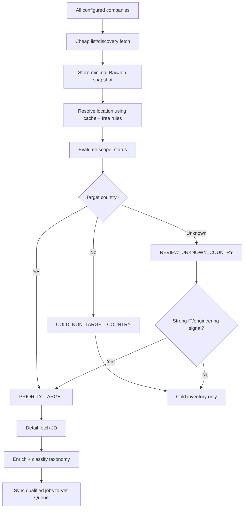

# Scoped Harvest Pipeline Implementation Plan

## Goal

Keep discovery broad so we do not miss jobs, but only spend expensive compute on jobs that matter now.

Current target scope:

- Countries: `US`, `IN`, `CA`, `GB`, `AU`
- Primary domains: IT and non-IT engineering

The system must still store every discovered job as cold inventory so future expansion does not require re-discovery.

## Core Flow



## Design Rules

1. Never delete or skip discovery rows only because they are outside target countries.
2. Store minimal RawJob data for every discovered job.
3. Use `country_code` and `scope_status`, not only a boolean.
4. `is_priority=True` means the job can enter expensive processing.
5. Unknown country is a review state, not a delete state.
6. Provider geocoding is optional and quota-guarded.
7. Provider tokens must live in environment variables, never code or database.

## Country Resolution Stack

Resolution order:

1. Existing ATS country field.
2. Normalized `LocationCache`.
3. Explicit country detector.
4. City/state/province rules.
5. Existing free country classifier.
6. Optional provider fallback for unresolved unique locations.

Important behavior:

- `San Francisco, CA` resolves to `US`, region `CA`.
- `Toronto, CA` resolves to `CA`.
- `Vancouver, BC, CA` resolves to `CA`.
- Blank/vague locations become `UNKNOWN`, not dropped.

## Provider Rate Limit

Provider fallback must stop before billing risk.

Default hard cap:

```text
geocoding_monthly_limit = 80000
```

Reason:

- Mapbox often advertises 100k monthly geocoding requests.
- We stop at 80k to leave safety margin.
- Provider calls are for unique unresolved normalized locations only, not every job row.

Provider setup:

```bash
export MAPBOX_ACCESS_TOKEN="..."
```

Do not commit tokens.

## Aggressive Caching

Cache key is `normalized_text`, not raw text only.

Examples that should converge as much as possible:

```text
San Francisco, CA
San Francisco, CA, United States
San Francisco, California
```

Cache stores:

- raw text
- normalized text
- country code
- country name
- region code/name
- city
- confidence
- source
- provider/provider place id
- status

Unknown results are cached too so the same bad location does not repeatedly hit provider fallback.

## RawJob Fields

Added fields:

```text
country_code
country_confidence
country_source
scope_status
scope_reason
is_priority
last_scope_evaluated_at
```

Scope statuses:

```text
UNSCOPED
PRIORITY_TARGET
REVIEW_UNKNOWN_COUNTRY
COLD_NON_TARGET_COUNTRY
COLD_NO_LOCATION
```

## Engine Settings

Added to Harvest Engine Config:

```text
target_countries
process_unknown_country_with_target_domain
geocoding_cache_enabled
geocoding_provider_enabled
geocoding_provider
geocoding_monthly_limit
```

GUI location:

```text
Jobs -> Engine
```

## Backfill Commands

Evaluate existing RawJob rows without provider:

```bash
python manage.py evaluate_rawjob_scope --all --batch-size 1000
```

Dry-run first:

```bash
python manage.py evaluate_rawjob_scope --all --limit 1000 --dry-run
```

Evaluate only unscoped future rows:

```bash
python manage.py evaluate_rawjob_scope --only-unscoped --batch-size 1000
```

Provider fallback only after free resolver numbers are reviewed:

```bash
python manage.py evaluate_rawjob_scope --only-unknown --provider --batch-size 500
```

## Analytics Required

Board analytics should show:

- Country resolved %
- Target country %
- Priority jobs %
- Unknown-country review %
- Cold non-target %
- No-location %

These metrics tell us whether the country detector is trustworthy before we gate expensive tasks.

## Rollout Order

Phase 1:

- Add RawJob scope fields.
- Add LocationCache.
- Add Engine country/provider settings.
- Add resolver and scope evaluator.
- Add backfill command.
- Add scoped board analytics.

Phase 2:

- Run scope dry-run on production.
- Apply migrations.
- Run full scope backfill without provider.
- Review unknown/cold/priority counts by board.

Phase 3:

- Gate JD backfill, enrichment, link validation, sync, and consultant matching by `is_priority=True`.
- Keep broad discovery unchanged.

Phase 4:

- Add unknown-country review UI.
- Enable provider fallback only for unresolved unique locations if needed.

Phase 5:

- Add board-specific API filters only after post-fetch scoping has proven accurate.
- API filters must be board-by-board and reversible.

## Definition Of Done

The project is safe when:

- Every discovered job is stored minimally.
- Priority/cold/unknown counts are visible by board.
- Target countries can be changed from GUI.
- Non-target jobs do not enter expensive processing.
- Unknown-country jobs are reviewable.
- Provider geocoding cannot exceed the configured monthly cap.
- Mapbox/Google tokens are never stored in source code.
